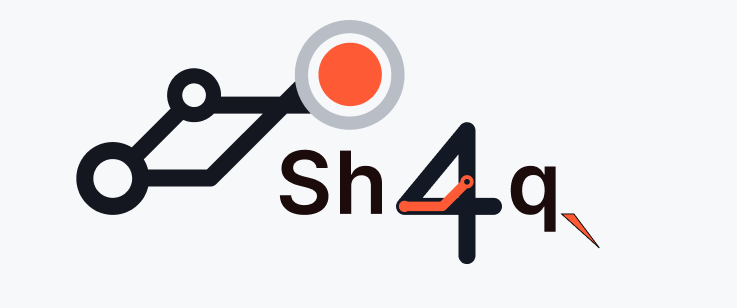

<h1 align="center">Sh4q</h1>

<table><tr><td align="center" bgcolor="#f5f7f9"></td></tr></table>

<p align="center">
  <a href="https://github.com/0x5h4q/Sh4q/releases/tag/v0.1.0"></a>
  <a href="https://github.com/0x5h4q/Sh4q/blob/main/LICENSE"></a>
  <a href="https://www.python.org/"></a>
  <a href="https://github.com/0x5h4q/Sh4q"></a>
  
</p>

<p align="center"><strong>Know what you touched. Know why. Know it was authorised.</strong></p>

Sh4q helps security learners and practitioners map domains they own or are
authorised to test. Give it a domain and it checks DNS, looks for related
subdomains, checks which hosts respond over HTTP, records detected technologies,
and produces reports you can inspect or share.

It is a research prototype. It is not a vulnerability scanner, an exploitation framework, or a replacement for mature reconnaissance suites.

## Walkthrough

This short recording shows an authorised Sh4q scan, reviewing discovered
assets, filtering results, and exporting an HTML report.


The example uses a bug-bounty target with permission to test. Always confirm
the target's current program scope and disclosure rules before running or
publishing a scan.

## Start Here

If you are new to reconnaissance, think of Sh4q as a careful inventory tool:

- **Found** means a source mentioned a hostname or URL.
- **Resolved** means DNS returned an address for a hostname.
- **Responded** means an HTTP request received a response.
- **Historical** means a URL appeared in an archive; it is not proof that the
  URL works today.

Sh4q never treats every name returned by a tool as a confirmed live asset. It
checks scope before saving trusted results and keeps the original observation
so you can see where each result came from.

## When To Use It

- You are learning recon and want one understandable report instead of several
  disconnected tool outputs.
- You are checking a company domain you have written permission to assess and
  want to avoid accidentally following an out-of-scope redirect.
- You are comparing two authorised scans and want to see what changed.
- You are handing results to a teammate who needs the evidence and limitations,
  not just a list of hostnames.

For maximum collection breadth or active testing, use specialist tools such as
reconFTW alongside Sh4q. Sh4q is the control and reporting layer, not a
replacement for every security tool.

## The Difference In One View

**A typical shell workflow**

```text
run several tools -> join output files -> filter names by hand ->
check redirects and scope manually -> explain failures from shell history
```

**With Sh4q**

```text
sh4q scan target.example -> scope checks -> DNS/HTTP evidence ->
scan-owned results -> filtered HTML/JSON/CSV report
```

Sh4q does not make specialist tools unnecessary. It makes the combined result
easier to understand, safer to review, and easier to hand to someone else.

## Why Scope Matters

Reconnaissance can leave your authorised target without you noticing. A DNS
name may resolve to a private address, a page may redirect to a payment or
cloud provider, or an external tool may return a hostname that was never in the
engagement rules.

That matters for three practical reasons:

1. **Permission:** written authorisation normally covers specific domains,
   addresses, ports, and dates. It does not automatically cover every service
   a target links to.
2. **Third parties:** contacting a payment processor, cloud service, or identity
   provider can create alerts or complaints for an organisation that never
   agreed to the test.
3. **Accountability:** a client or teammate may ask exactly what was contacted.
   A recorded scope decision, failure, and scan ID is stronger than trying to
   reconstruct the answer from shell history.

Sh4q cannot grant legal permission. It provides technical guardrails and a
record of its decisions; the operator must still confirm the engagement rules.

## Why Sh4q Exists

Tools such as reconFTW are optimized for breadth: they coordinate a large
number of enumeration, crawling, fuzzing, OSINT, and vulnerability-testing
utilities. Sh4q deliberately operates at a different layer. It provides a
scope and evidence control plane around discovery workflows so that each
accepted asset has a scope decision, source information, durable state, and
reviewable output. In plain terms: you can tell what Sh4q found, which tool or
stage found it, whether it was checked, and why it appears in the report.

Use reconFTW or other specialist tools when maximum collection breadth is the
goal. Use Sh4q when you need to understand what was contacted, why it was
accepted, what failed, and which observations are supported by recorded data.

## Example Scenarios

**Learning on a lab domain**

```bash
sh4q scan lab.example
```

Start with the default scan. Review the summary, then open the HTML report to
filter by host, response status, technology, or source.

**Authorised bug-bounty reconnaissance**

```bash
sh4q scan company.example --sub --httpx
```

Subfinder looks for additional names, Sh4q checks which names resolve and
respond, and HTTPX adds technology observations for approved endpoints.

**Looking for older paths**

```bash
sh4q scan company.example --url-history
```

This uses Wayback history only. Historical URLs are labelled separately and
are never presented as currently live without a later HTTP observation.

## See The Result

The HTML report is the easiest way to see Sh4q’s value. It is a self-contained
file that works offline and lets you filter scan-owned assets by host, type,
HTTP status, technology, source, or free-text search. It also shows failures,
stage timings, request metrics, and evidence counts, so the report explains the
scan rather than presenting an unexplained list of results.

**Example: an authorised financial-services engagement**

Imagine a fictional bank gives you written permission to assess
`*.acme-bank.example` and a specific public network range, while excluding
`internal.acme-bank.example` and a payment processor. A typical workflow can
produce names outside that boundary or follow a redirect to a third party.

With Sh4q, place the approved targets and exclusions in a configuration file:

```yaml
scope:
  targets:
    - "acme-bank.example"
  excluded:
    - "internal.acme-bank.example"
    - "payments.acme-bank.example"
  ports: [80, 443]
rate_limit:
  requests_per_second: 2
  max_concurrent: 3
  budget: 1000
```

Then run only the explicitly authorised workflow:

```bash
sh4q scan acme-bank.example --sub --httpx --config config/acme-bank.yaml
```

The report makes the boundaries visible: a discovered hostname is checked
before it is trusted, a private address is rejected by default, and a redirect
to an excluded or unrelated service is recorded as denied rather than followed.
If a reviewer asks “what did the scan contact?”, the scan ID, evidence index,
failures, and request metrics provide an answer instead of a guess. This is an
illustrative example only; use real targets only with written permission.

## Quick Start

Requirements: Linux, Python 3.11 or newer, and Git. Subfinder is optional.

```bash
git clone <repository-url>
cd sh4q
python3 -m venv venv
source venv/bin/activate
python -m pip install -e .
```

For a globally available command with isolated dependencies, use `pipx`:

```bash
pipx install git+https://github.com/0x5h4q/Sh4q.git@v0.1.0
```

Scan a domain you own or are explicitly authorised to test:

```bash
sh4q scan your-domain.example
```

If Subfinder is installed:

```bash
sh4q scan your-domain.example --sub
```

For passive Wayback URL history, install `waybackurls` separately and opt in:

```bash
sh4q scan your-domain.example --url-history
```

Review the latest scan:

```bash
sh4q show --latest --target your-domain.example
sh4q results --latest --target your-domain.example --type url
sh4q results --latest --target your-domain.example --type technology
```

Compare two scan snapshots without changing either scan:

```bash
sh4q diff --before OLDER_SCAN_ID --after NEWER_SCAN_ID
```

Export HTTP-responsive domains:

```bash
sh4q export --latest --target your-domain.example --alive http --format csv --output alive.csv
```

Generate a self-contained, offline-filterable HTML asset report:

```bash
sh4q export --latest --target your-domain.example --format html --output report.html
```

Before sharing a report, use opt-in redaction to mask secret-like query values
and remove URL fragments. Redaction changes only the exported file; the local
database and evidence remain unchanged:

```bash
sh4q export --latest --format html --output report-redacted.html --redact
```

## Documentation

- [Installation](docs/installation.md)
- [Quick start](docs/quickstart.md)
- [Authorised use](docs/authorized_use.md)
- [Architecture](docs/architecture_overview.md)
- [v1 baseline](docs/v1_baseline.md)
- [v2 JavaScript extraction specification](docs/v2_javascript_extraction_spec.md)
- [Threat model](docs/threat_model.md)
- [Known limitations](docs/limitations.md)
- [Passive URL-history policy](docs/url_history_policy.md)
- [v1 roadmap](docs/v1_roadmap.md)
- [Troubleshooting](docs/troubleshooting.md)
- [Testing](docs/testing.md)
- [Feedback guide](docs/feedback.md)
- [Contributing](CONTRIBUTING.md)
- [Security policy](SECURITY.md)

The roadmap, threat model, limitations, and feedback guide are included for
reviewers. The continuation handoff is an internal engineering note. The
outreach pitch is a separate communication aid and is not required to install
or use Sh4q.

The default database is `./sh4q-output/sh4q.db`. It may contain sensitive target data and must not be committed or shared without review.

## Current Capabilities

- Gate 1 target authorisation and Gate 2 discovery validation.
- Reserved/private address controls and redirect validation.
- DNS, HTTP, certificate-transparency, and optional Subfinder discovery.
- Optional passive Amass discovery and ProjectDiscovery HTTPX enrichment.
- Bounded discovered-host DNS and HTTP enrichment.
- Durable events, retries, interruption handling, and evidence storage.
- Per-scan ownership, results, scan overview, JSON/CSV export, and liveness filters.
- Conservative native technology observations from already-authorised HTTP responses.
- A deterministic offline suite used by CI.
- A self-contained HTML asset report with client-side filters for type, host,
  status, technology/category, source, and text search.

## Project Status

Sh4q `v0.1.0` is available as a limited review release for trusted testers.
Expect variable live-provider results and the documented limitations
around completeness, active scanning, and external-tool availability. Passive
Amass support is experimental and optional.

Sh4q is released under the [MIT License](LICENSE).
