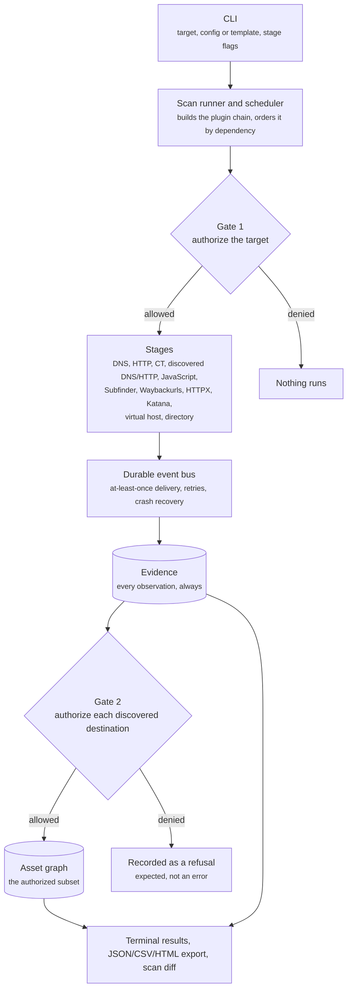
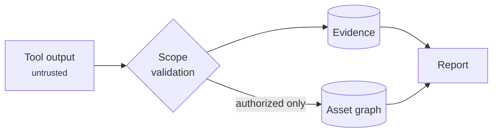

# Sh4q Architecture

Sh4q is a local, SQLite-backed policy and evidence layer around authorised
reconnaissance workflows. It coordinates discovery stages, checks scope before
trusting results, and builds reports from stored evidence rather than directly
from tool output.

## System Flow

Evidence is written **before** Gate 2 decides, unconditionally. That ordering is
the point: evidence is the audit trail of everything observed, and the graph is
only the subset that policy allowed. A Gate 2 refusal is a recorded outcome, not
a failure.

The central data path is:

An external tool may return anything. Sh4q retains the raw observation, but a
hostname or destination becomes a trusted graph asset only after the relevant
scope checks pass.

## Main Components

### CLI and scan runner

The CLI accepts a target, configuration, and optional stages. The scan runner
creates the scan record and asks the scheduler to execute selected stages in
dependency order.

### Scheduler and event bus

The scheduler controls stage attempts, timeouts, retries, and progress events.
Events are persisted and handlers tolerate at-least-once delivery, so repeated
events do not create duplicate trusted results.

### Scope engine

Gate 1 checks the initial target. Gate 2 is applied to discovered names,
resolved addresses, HTTP destinations, and redirects. Reserved or non-public
addresses and destinations outside configured scope are denied by default.

### Plugins and adapters

Plugins provide native DNS, HTTP, certificate-transparency, and technology
checks. Adapters integrate optional tools through bounded subprocess execution
and parsed output.

### Storage and reporting

SQLite stores scan-owned observations, the deduplicated asset graph, evidence,
failures, relationships, and technology signals. Terminal views and JSON, CSV,
HTML, and diff exports are projections of that stored record.

## Current Boundary

The v1 release is a single-machine application using SQLite. It is designed for
authorised discovery and inventory, not exploitation, vulnerability scanning,
distributed execution, or guaranteed-complete attack-surface mapping.

Planned v2 work includes a dashboard, an API, PostgreSQL support for larger or
shared deployments, and additional controlled adapters. Those are future
deployment options, not requirements of the current v1 architecture.

See the [threat model](threat_model.md) for trust boundaries and security
controls, and [known limitations](limitations.md) for behaviours that remain
explicitly out of scope.
