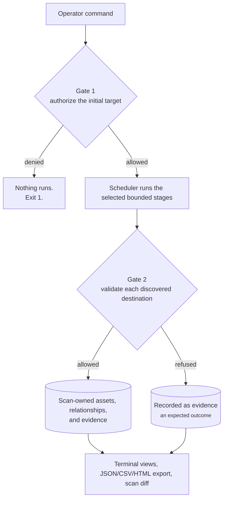

# Sh4q Current State and Maintainer Guide

This is the primary orientation document for Sh4q maintainers. It describes
the current product, what is released, how its parts fit together, and the
checks required before work moves forward. Historical, academic, and design
documents provide context but do not override this guide.

## Current Release

- Published release: `v1.3.0`
- Package version on `main`: `1.3.0`
- Runtime: Python 3.11 or newer on Linux
- Deployment model: local, single-user CLI backed by SQLite
- Distribution: GitHub release and tag; wheel and source artifacts built and
  verified locally; tagged `pipx` installation supported
- GitHub Actions: the account is billing-locked, so no workflow job can start.
  Jobs were being refused with `The job was not started because your account is
  locked due to a billing issue`, which surfaced on pull requests as red checks
  that said nothing about the code. The `Offline tests` and `Release` workflows
  are therefore disabled manually, and Dependabot's `github-actions` ecosystem
  is paused. Dependabot's `pip` ecosystem still runs, because those updates can
  be verified locally. Do not describe remote CI as running: the offline suite
  has never once passed on GitHub, and every release so far was published by
  hand after local verification

Sh4q is a policy-controlled reconnaissance and evidence tool. It is not a
vulnerability scanner, exploitation framework, broad port scanner, or a
guaranteed-complete attack-surface platform.

## The Mental Model



Gate 1 and Gate 2 are the core invariants. New features must not bypass them.
External tools produce untrusted observations; Sh4q validates their output
before it becomes trusted inventory.

## Scan Modes

The default scan runs:

```text
dns -> http -> certificate transparency
```

Profiles are convenience bundles:

| Mode | Additional stages |
| --- | --- |
| `--profile web` | JavaScript extraction and bounded bundle inspection |
| `--profile full` | Subfinder, HTTPX, URL history, JavaScript extraction, and bundles |

The following remain explicit because they are experimental, active, or can
create materially more traffic:

| Option | Purpose | Boundary |
| --- | --- | --- |
| `--katana` | Runtime URL and XHR discovery | Active crawler, same-scope and bounded |
| `--vhosts` | Virtual-host probing | Active-low, maximum 500 candidates |
| `--directories` | Directory/path probing | Active-low, supplied file and request budget |

Virtual-host candidates can come from `--vhosts-file`,
`--vhosts-from-scan`, or discoveries made earlier in the same scan. Directory
discovery always requires `--directories-file`.

## Configuration and Scope

New YAML configuration files declare:

```yaml
schema_version: 1
```

The file defines scope, exclusions, ports, private-address policy, rate limits,
timeouts, output location, logging, and adapter bounds. Unversioned files are
accepted as legacy version 1. Unsupported or malformed versions fail before
network activity.

Without `--config`, Sh4q derives a narrow scope from the target and permits its
subdomains on ports 80 and 443. Private and reserved addresses are denied by
default.

## Stored Record

Each scan records:

- scan identity, target, timestamps, and status;
- accepted domains, addresses, URLs, technologies, and relationships;
- source-plugin ownership for exact per-scan views;
- raw evidence, rejected observations, failures, retries, and provider status;
- native request metrics and ordered stage metrics.

The global graph deduplicates assets. Evidence remains observation-oriented,
so asset counts and evidence counts intentionally mean different things.

The default database is `./sh4q-output/sh4q.db`. Treat it and generated reports
as potentially sensitive engagement data.

## Operator Workflow

Check the installation and optional tools:

```bash
sh4q --version
sh4q doctor
```

Run the smallest authorized scan that answers the operator's question:

```bash
sh4q scan target.example
```

Inspect the exact result:

```bash
sh4q scans
sh4q show --latest --target target.example
sh4q results --latest --target target.example --type domain
sh4q results --latest --target target.example --type url
sh4q results --latest --target target.example --failures
```

Export or compare scan-owned records:

```bash
sh4q export --latest --target target.example --format html --output report.html
sh4q diff --before BEFORE_SCAN_ID --after AFTER_SCAN_ID
```

## Feature Status

Stable current capabilities:

- scope validation and scoped native networking;
- DNS, HTTP, CT, discovered-DNS, and discovered-HTTP stages;
- durable events, evidence, scan ownership, metrics, and SQLite migrations;
- Subfinder, Waybackurls, HTTPX, JavaScript extraction, and bundle inspection;
- terminal results, scan overview, JSON/CSV/HTML export, redaction, and diff;
- quiet, verbose, and JSONL progress modes;
- versioned configuration schema and named scan templates;
- every authorized port probed, not only the well-known pair;
- resolution and probing of discovered names (`--resolve`) and of an
  operator-supplied host list (`--hosts-file`);
- hostname composition and response-attribute reporting (`results --names`,
  `results --response-attributes`).

Implemented explicit capabilities, never enabled by a profile:

- Katana crawling;
- virtual-host discovery;
- directory discovery.

Retired:

- the Amass adapter, removed after `v1.2.0`. Amass stopped printing discovered
  names to standard output at v4, so the adapter observed nothing and reported
  an empty stage. `--sub` covers passive subdomain discovery.

Not implemented yet:

- built-in scheduling;
- proxy configuration;
- comparison metadata for effective configuration and tool versions;
- public API, dashboard, worker queue, PostgreSQL deployment, authentication,
  or RBAC.

## Development Order

The current workflow-foundations milestone proceeds in this order:

1. Versioned configuration files: complete.
2. Named scan templates with explicit stage/risk disclosure: implemented and
   merged, with validation covering stage lists, both candidate-file fields,
   stage/file pairing, and conflicts against every template-owned CLI option.
   Per-stage disclosure of risk level, required tool, and effective limit
   remains follow-up work.
3. Persist effective template/configuration and tool-version identity for
   repeatable comparisons.
4. Proxy support with explicit per-transport and per-adapter behavior.
5. Scheduling guidance or integration built on stable templates.
6. Platform v2 design only after the local workflow is stable.

Do not add another discovery adapter merely because one is available. Add one
only when it solves a defined operator workflow and retains scope, evidence,
provenance, bounds, and offline coverage.

## Post-Merge Acceptance Checklist

Run these commands from the repository root with the development environment
active:

```bash
git switch main
git pull --ff-only origin main
python -m pip install -e .
sh4q --version
sh4q --help
sh4q scan --help
PYTHONPATH=. python tests/test_documentation_qa.py
PYTHONPATH=. python tests/test_config_schema_version.py
python tools/run_offline_tests.py
git status --short
```

Acceptance means:

- the package version and release documentation agree;
- CLI help opens without a traceback;
- focused tests for the changed behavior pass;
- the full offline runner passes on a supported, known-good environment;
- network-dependent checks are clearly identified and run only by the operator
  against an authorized target;
- no database, report, recording, candidate list, credential, or target evidence
  is staged;
- the PR states motivation, implementation, exact tests, and any unverified
  environment-dependent behavior.

The `v1.3.0` release was validated locally on Python 3.14.4: 77/77 offline
tests, documentation and configuration-schema checks, a fresh-wheel
installation, and an end-to-end scan against a local lab target exercising the
virtual-host, directory, JavaScript, and template paths. An earlier note here
warned that Python 3.14 reproduced timeouts in the async event and SQLite
tests; that has not recurred in repeated runs during this cycle. Report a
full-suite pass only when the runner actually completes.

## Documentation Authority

Use documents in this order when claims conflict:

1. Current code and focused executable tests.
2. This current-state guide.
3. Operator, installation, architecture, threat-model, and limitations docs.
4. The roadmap.
5. Design records under `docs/design/`.
6. Historical and academic material.

Git history replaces session handoff transcripts. New handoff files should not
be committed as permanent product documentation.
