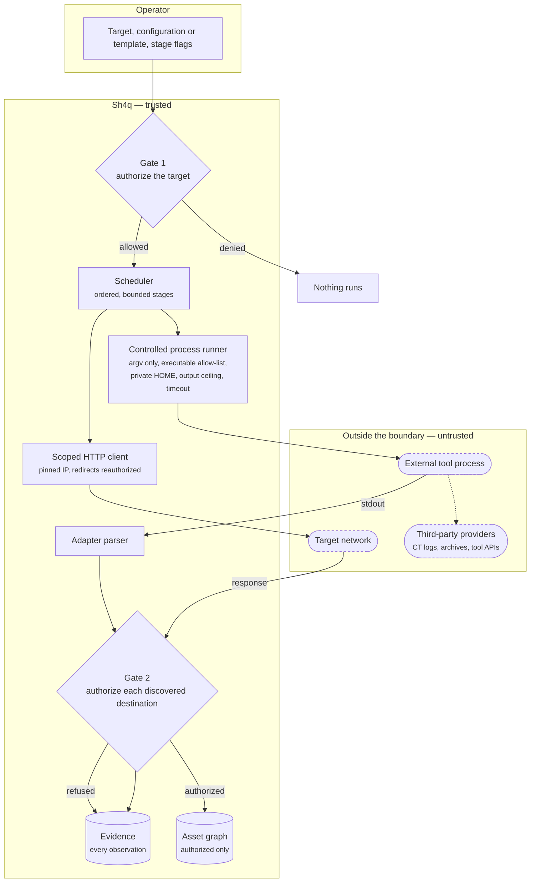

# Threat Model

## Security Goal

Sh4q aims to keep authorised reconnaissance inside a central policy and evidence boundary. A discovery is not trusted merely because a plugin or external tool emitted it.

## Protected Assets

- The configured target scope.
- The integrity of the trusted asset graph.
- Raw discovery evidence and provenance.
- Durable event and scan history.
- Local output files and adapter working directories.

## Main Trust Boundaries

Two things the diagram is meant to make obvious. Everything leaving Sh4q passes
a gate first, and everything returning passes Gate 2 before it can become an
asset — including output from a tool Sh4q itself launched. And evidence is
written on **both** Gate 2 paths: a refusal is recorded, not discarded, which is
what makes the boundary auditable rather than merely enforced.

The dashed nodes are outside the boundary. Sh4q controls how an external tool
is launched and how its output is read, but not what that tool does on the
network: packets a tool generates internally do not pass through Sh4q's
transport. `httpx` input is restricted to scan-owned, reauthorized endpoints for
this reason.

Native HTTP requests pass through the scoped HTTP client. External-tool output passes through the adapter parser and Gate 2 before asset persistence.
External `httpx` inputs are restricted to scan-owned, reauthorised HTTP endpoints, but packets generated inside the tool are not routed through Sh4q's native network transport.

## Controls Implemented

- Gate 1 validates the initial target.
- Gate 2 validates discovered hostnames and HTTP destinations before trusted persistence.
- Reserved and non-public addresses are denied by default.
- Redirect destinations are reauthorised before contact.
- HTTP connections use an approved IP while preserving hostname identity for TLS and the `Host` header.
- Mixed public/private DNS answers are rejected.
- External commands use argument arrays, an executable allow-list, bounded output, timeouts, reduced environments, and no shell.
- Event delivery is durable and handlers are designed for at-least-once processing.
- Scan ownership separates exact run observations from the deduplicated global graph.
- Technology results retain signals and confidence rather than being treated as certain facts.
- SQLite schema versions prevent silent use of unsupported newer databases.

The offline Subfinder scheduler integration test exercises these boundaries
together: controlled process execution, output parsing, EventBus delivery,
Gate 2 rejection, evidence retention, and source-plugin ownership. It uses
deterministic fakes and does not contact a live target.

## Threats Addressed

- An out-of-scope initial target.
- A plugin returning an out-of-scope hostname.
- Redirects to an unauthorised host.
- DNS rebinding between policy approval and connection.
- Resolution to loopback, private, link-local, multicast, reserved, or otherwise non-public addresses.
- Shell injection through adapter arguments.
- Adapter hangs or excessive output.
- Duplicate event delivery.
- Process interruption during queued event handling.
- Passive names being falsely described as live assets.

## Out of Scope or Incomplete

- A malicious local user with access to the database or process.
- A compromised operating system or Python environment.
- Full containment of packets generated inside an external tool.
- Distributed or multi-host execution.
- Protection against every form of resource exhaustion.
- Verifying that the user has legal permission.
- Guaranteeing completeness or correctness of third-party provider data.
- Proving a detected technology or version is actually deployed behind a proxy or CDN.
- Resuming an interrupted plugin call at the exact network-operation boundary.

## Security Assumptions

- The configuration and local machine are controlled by the tester.
- Dependencies and optional tools are obtained from trusted sources.
- The SQLite database is not shared with untrusted users during a scan.
- The tester uses the narrowest authorised scope and respects external program rules.

## Reporting a Safety Issue

Do not test a suspected safety bypass against an unrelated live target. Reproduce it with the offline suite, a local fixture, or infrastructure you control. Include the Sh4q commit, configuration, expected policy decision, actual contact attempt, and a redacted trace.
